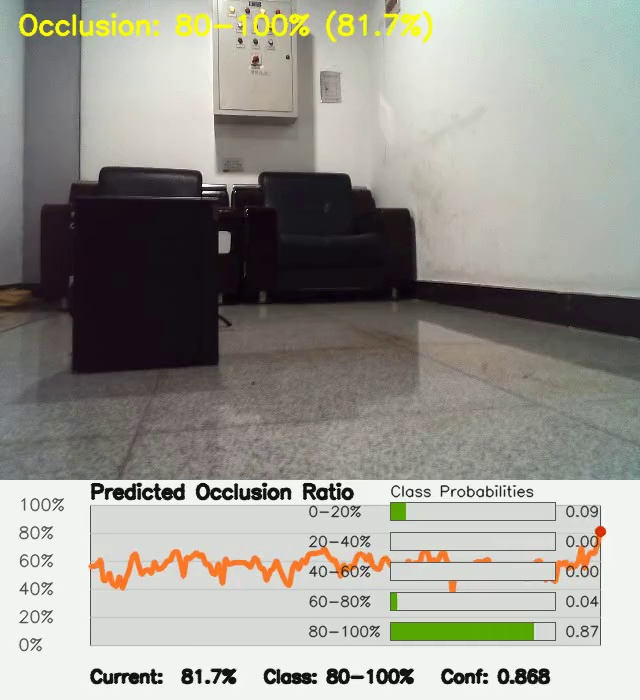
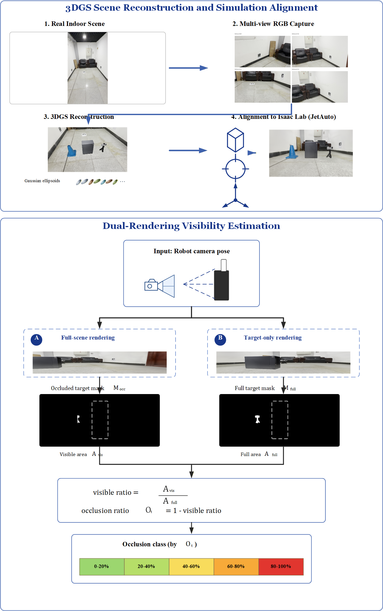
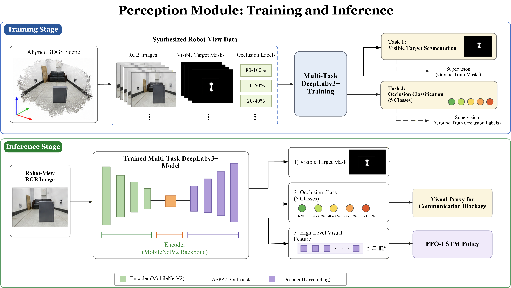
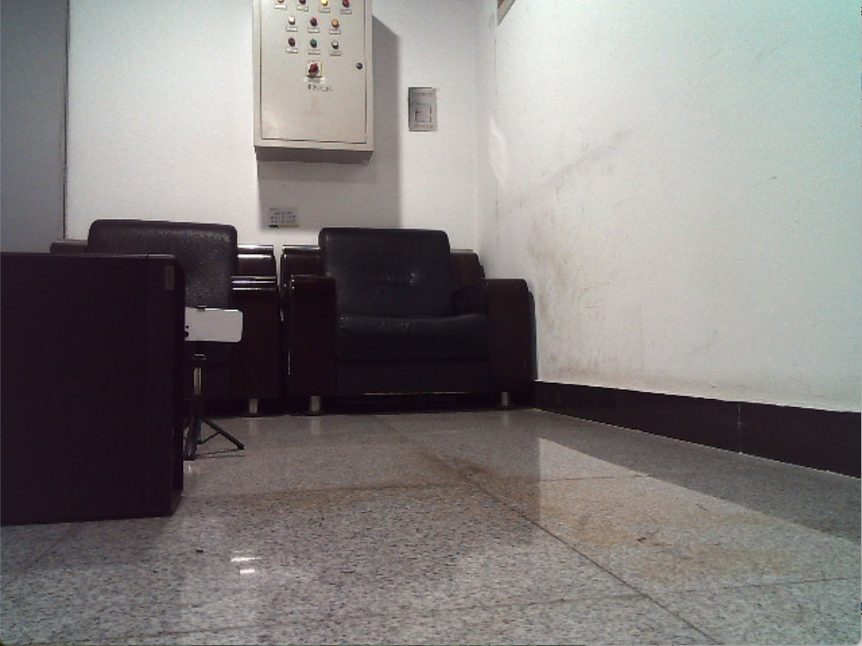
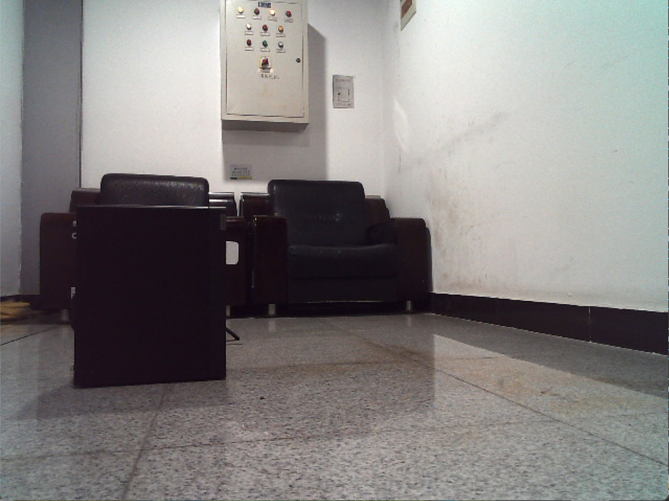

# JetAuto RL Navigation

Simulation-to-real visual navigation for a JetAuto mecanum robot using aligned 3D Gaussian Splatting, multitask occlusion perception, and recurrent reinforcement learning.

<p align="center">
  <a href="https://xcer1204.github.io/jetauto_rl_navigation/">
    
  </a>
</p>

<p align="center">
  <a href="https://xcer1204.github.io/jetauto_rl_navigation/">Project Page</a>
  |
  <a href="docs/assets/video/real_robot_demo.mp4">Demo Video</a>
</p>

## Overview

This repository contains the Isaac Lab side of a JetAuto navigation project built around a visibility-aware sim-to-real pipeline:

- Real indoor scenes are reconstructed with 3DGS and aligned to Isaac Lab.
- A multitask DeepLab branch predicts visible target masks, occlusion classes, and reusable visual features.
- A PPO-LSTM policy consumes those features to navigate under partial target blockage.
- The learned policy is validated on a real JetAuto robot with a monocular robot-view camera.

The repository focuses on training, playback, and evaluation in Isaac Lab, while the project page documents the real-robot rollout used for validation.

## Highlights

- 3DGS-based scene reconstruction and simulation alignment for robot-view navigation.
- Multitask perception with visible-target segmentation plus 5-bin occlusion classification.
- Recurrent PPO policy for partially observable navigation.
- Real-camera closed-loop rollout presented directly on the project page.

## Project Page

The project page is stored in [`docs/`](docs/) and is intended for GitHub Pages:

- `docs/index.html`: landing page with embedded video and explanations
- `docs/assets/img/`: figures and demo poster
- `docs/assets/video/`: real-robot demo video used directly by the page

Once GitHub Pages is enabled, the page URL will be:

```text
https://xcer1204.github.io/jetauto_rl_navigation/
```

## Repository Layout

```text
source/jetauto_navigation/jetauto_navigation/tasks/direct/
source/jetauto_navigation/jetauto_navigation/tasks/manager_based/
scripts/train_gs.py
scripts/play_gs.py
scripts/evaluate_gs.py
scripts/evaluate_gs_baselines.py
```

- `direct/`: direct-control JetAuto environments
- `manager_based/`: manager-based VR-Robo environments and observation/reward logic
- `train_gs.py`: recurrent or feedforward skrl training entry point
- `play_gs.py`: checkpoint playback and optional video recording
- `evaluate_gs.py`: rollout evaluation with success and occlusion metrics

## Setup

1. Install Isaac Lab and Isaac Sim.
2. Clone this repository outside the Isaac Lab source tree.
3. Install the extension in editable mode:

```bash
python -m pip install -e source/jetauto_navigation
```

4. Update any machine-specific paths in the environment configs if needed, especially:

- external 3DGS render server host and ports
- DeepLab multitask checkpoint path
- DeepLab project root path

## Representative Commands

List the registered JetAuto tasks:

```bash
python scripts/list_envs.py
```

Train the manager-based VR-Robo task with the recurrent skrl config:

```bash
python scripts/train_gs.py \
  --task Jetauto-VRRobo-Manager-v0 \
  --agent skrl_lstm_cfg_entry_point \
  --policy_term gs_image
```

Play a trained recurrent checkpoint:

```bash
python scripts/play_gs.py \
  --task Jetauto-VRRobo-Manager-Play-v0 \
  --agent skrl_lstm_cfg_entry_point \
  --checkpoint <path-to-best_agent.pt>
```

Evaluate a checkpoint over multiple episodes:

```bash
python scripts/evaluate_gs.py \
  --task Jetauto-VRRobo-Manager-Play-v0 \
  --agent skrl_lstm_cfg_entry_point \
  --checkpoint <path-to-best_agent.pt> \
  --episodes 100
```

## Figures

### Pipeline Overview



### Perception Module



### Real-Robot Snapshots

<p align="center">
  
  
</p>

## Notes

- The project page is the best place to present the video, figures, and explanation together.
- The embedded demo video is used directly from the recorded real-robot run.
